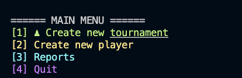

# Projet 4 : **Chess Game**
***Projet 4 du parcours D-A Python d'OpenClassrooms : application de gestion de tournoi d'échecs avec base de données.***

## Table des matières

1. [Démarrer le projet](#id-section1)
    1. [MacOS et Linux](#id-section1-1)
    3. [Générer un rapport flake8](#id-section1-2)
2. [Options des menus](#id-section2)
    1. [Menu principal](#section2-1)
    2. [Rapports](#section2-2)
3. [Exemples d'affichage](#section3)

## 1. Initialisation du projet

---------

#### ii. MacOS et Linux :
Dans le terminal, naviguer vers le dossier souhaité.
###### Récupération du projet

    $ git clone https://github.com/Sandy2080/Chess-Tournament

###### Activer l'environnement virtuel
    $ cd chess-game-2
    $ python -m venv env 
    $ ~env\bin\activate
    
###### Installer les paquets requis
    $ pip install -r requirements.txt

###### Lancer le programme
    $ python3 main.py

----------

#### iii. Générer un rapport flake8

    $ flake8 --format=html --htmldir=flake8_report

**Vous trouverez le rapport dans le dossier _'flake8-report'_.**

_Dernier rapport exporté :_

## 2. Options des menus

#### i. Menu Principal

#### ii. Menu des rapports

## 3. Exemples de rapports
#### Rapport des rondes :

#### Matchs d'une ronde :

#### Rapport des joueurs :

